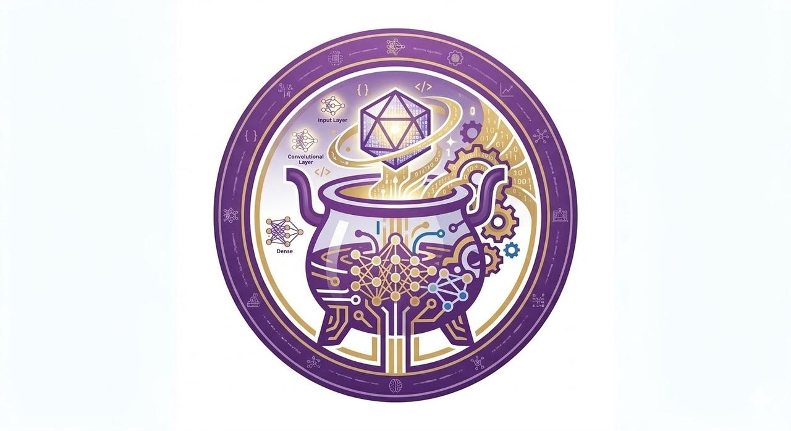

<div align="center">
  

  # Alchemy

  ### 炼丹炉已经备好，请炼制你的算法

  <p>
    <strong>一个面向自动化 AI 科研的标准化研究环境。</strong><br/>
    AI Scientist 只需交付 <code>algorithm.py</code> + <code>hyperparameter.yaml</code>，Alchemy 负责把科研基础设施接起来。
  </p>

  <p>
    
    
    
    
  </p>

</div>

<p align="center">
  
</p>

## ⚗️ 为什么需要 Alchemy

> **自动化 AI 科研的难点，不只是"提出一个想法"，而是"让这个想法在真实实验系统里稳定、规模化地跑起来"。**

今天的大多数 AI Scientist 系统，把科学发现与科研基础设施揉在同一条链路里。AI Scientist 不仅要提出方法，还被迫处理数据接线、任务配置、训练调度、并发执行、结果收集等工程细节——这些不应该占用它最宝贵的上下文窗口和推理预算。

Alchemy 将两者显式分离：

<table>
  <tr>
    <td width="50%" valign="top">
      🧠 <strong>Scientist 层</strong> (<code>ai_scientist/</code>)<br/><br/>
      负责假设生成、算法实现、超参数设计与多轮迭代。<br/>
      <strong>专注于：</strong>提出假设 → 设计方法 → 根据反馈迭代
    </td>
    <td width="50%" valign="top">
      🔥 <strong>研究环境层</strong> (<code>research_environment/</code>)<br/><br/>
      负责任务配置、GPU 调度、容器执行、指标解析与结果收集。<br/>
      <strong>负责：</strong>科研基础设施 → 异构设备 → 高并发实验
    </td>
  </tr>
</table>

## 🧪 核心接口

AI Scientist 交给 Alchemy 的，是构成算法的两份文件：

<table>
  <tr>
    <td width="50%" valign="top">
      🧩 <strong><code>algorithm.py</code></strong><br/>
      代码实现：模型的架构。
    </td>
    <td width="50%" valign="top">
      🎛️ <strong><code>hyperparameter.yaml</code></strong><br/>
      超参数配置：算法各个超参数的搜索空间。
    </td>
  </tr>
</table>


可选增强：`domain_knowledge.md` 提供任务背景与经验知识，既可由用户维护，也可由 AI Scientist 在实验后自主总结。

## 🌐 支持的领域与任务

<table>
  <tr>
    <td width="33.33%" valign="top">
      🎯 <strong>推荐系统</strong><br/><br/>
      • 通用推荐<br/>
      • 序列推荐<br/>
      • 上下文感知推荐<br/>
      • 知识驱动推荐<br/>
      • 多模态推荐 (MMRec)
    </td>
    <td width="33.33%" valign="top">
      🕸️ <strong>图学习</strong><br/><br/>
      • 通用图学习<br/>
      • 图结构学习<br/>
      • 时序图学习<br/>
      • 噪声图学习<br/>
      • 图异常检测
    </td>
    <td width="33.33%" valign="top">
      ⏱️ <strong>时间序列</strong><br/><br/>
      • 异常检测<br/>
      • 分类<br/>
      • 插补<br/>
      • 长期预测<br/>
      • 短期预测
    </td>
  </tr>
</table>

> 当前 GitHub 已发布 Recsys / MMRec 与 TimeSeries，剩余任务将持续更新。新领域只需在 `research_environment/tasks/` 下添加目录 + plugin.py。

## 🚀 快速开始

### Step 1 · 配置 LLM

编辑 `ai_scientist/config.yaml`：

```yaml
model: "claude-opus-4-5-20251101"
base_url: "https://your-endpoint/v1"

tasks:
  - domain: Recsys
    task: MMRec
    metric: "recall@20"
    seeds: ["PGL_2025"]

max_rounds: 10
patience: 3
```

### Step 2 · 配置执行环境

编辑 [`research_environment/config.yaml`](research_environment/config.yaml)：

- 选择 `docker` 或 `singularity`
- 配置 `gpu_ids` 和 `max_per_gpu`

### Step 3 · 准备数据与镜像

以 MMRec 为例：

```bash
# 构建运行镜像
docker build -t mmrec:latest research_environment/tasks/Recsys/MMRec/container

# 数据已在 research_environment/tasks/Recsys/MMRec/dataset/ 下
```

### Step 4 · 启动

```bash
python -m ai_scientist
```

系统采用的AI Scientist遵循一般流程, seed baseline 出发，进入闭环：加载Seed Baseline → 生成假设 → 生成代码与超参 → 执行评测 → 反馈迭代。

## ❓ FAQ

<details>
  <summary><strong>Alchemy 只是另一个 AI Scientist 吗？</strong></summary>
  <br/>
  不是。Alchemy 的关键在于把 Scientist 层与研究环境层显式分离。它的价值来自这两层的分工，而不只是提出一个新的Agent。
</details>

<details>
  <summary><strong>能在单机单卡上运行吗？</strong></summary>
  <br/>
  可以。通过 <code>research_environment/config.yaml</code> 指定 GPU ID 和并发数。
</details>

<details>
  <summary><strong>怎么新增一个任务？</strong></summary>
  <br/>
  在 <code>research_environment/tasks/{domain}/{task}/</code> 下添加 <code>config.yaml</code> + <code>plugin.py</code>，实现 <code>expand_hp()</code> 和 <code>parse_output()</code> 两个方法, 并在pipeline中实现任务管线即可, 我们将会在下一个公布版本提升新增任务的便捷性, 如果你有什么需要集成的新任务, 欢迎联系我们, 联系方式在下方。
</details>

## 🤝 贡献指南

<table>
  <tr>
    <td width="50%" valign="top">
      🧪 <strong>新增任务</strong><br/>
      在 <code>research_environment/tasks/</code> 中补充新领域或任务。
    </td>
    <td width="50%" valign="top">
      🧠 <strong>优化科学发现</strong><br/>
      提升AI Scientist的科学发现能力。
    </td>
  </tr>
  <tr>
    <td width="50%" valign="top">
      📚 <strong>补充数据</strong><br/>
      补充 seed baseline, 数据集等等。
    </td>
    <td width="50%" valign="top">
      ⚙️ <strong>强化基础设施</strong><br/>
      优化执行器、调度器与异构环境支持。
    </td>
  </tr>
</table>

## 📬 联系我们

<table>
  <tr>
    <td width="58%" valign="top">
      <strong>李乐晖</strong><br/><br/>
      交流 Alchemy、自动化 AI 科研或合作共建，欢迎微信联系。<br/>
      建议备注：<code>Alchemy / 姓名 / 机构</code>
    </td>
    <td width="42%" align="center" valign="top">
      
    </td>
  </tr>
</table>

## 📎 引用

> 将在项目论文或官方发布信息确定后补充。

如果你已经在论文或技术报告中使用了 Alchemy，建议标注项目名称 `Alchemy` 及对应仓库地址。
